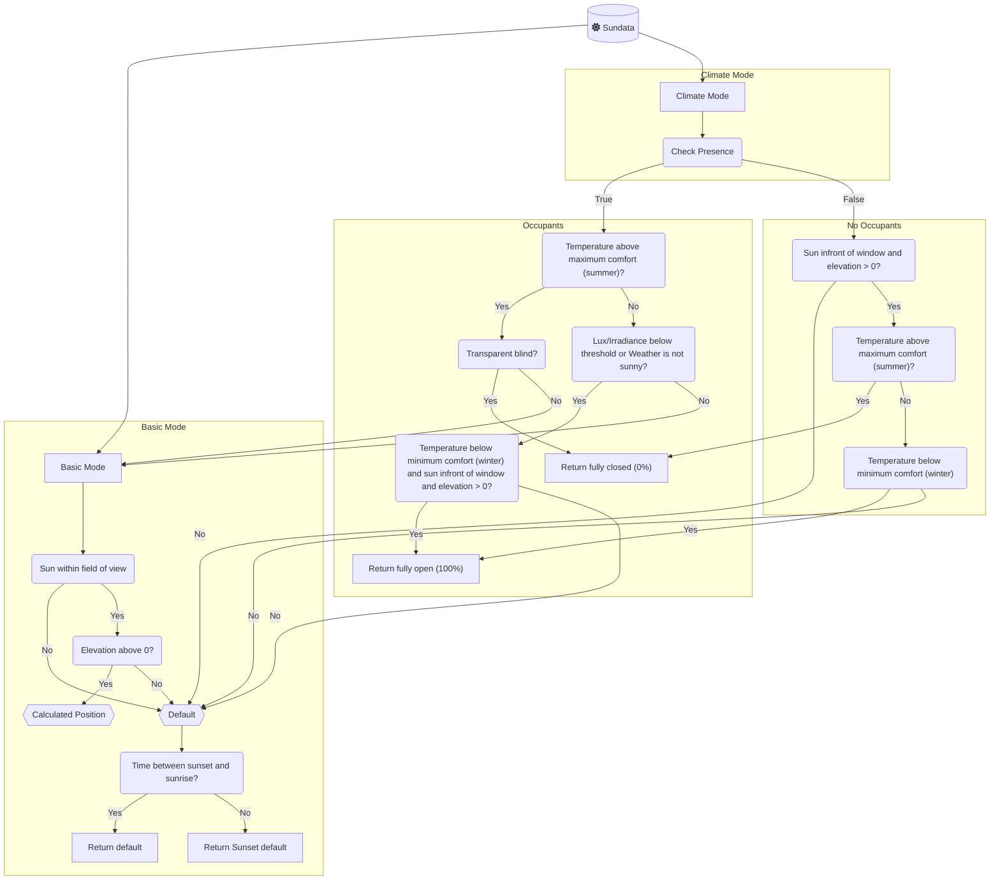

# Adaptive Cover Pro

This Custom-Integration provides sensors for vertical and horizontal blinds based on the sun's position by calculating the position to filter out direct sunlight.

This integration builds upon the template sensor from this forum post [Automatic Blinds](https://community.home-assistant.io/t/automatic-blinds-sunscreen-control-based-on-sun-platform/)

## Credits

**Adaptive Cover Pro** is a fork of the original [Adaptive Cover](https://github.com/basbruss/adaptive-cover) integration created by **[Bas Brussee (@basbruss)](https://github.com/basbruss)**.

This fork includes enhancements and modifications, but the core functionality and architecture are based on Bas Brussee's excellent work. Please visit the [original repository](https://github.com/basbruss/adaptive-cover) to see the upstream project and consider supporting the original author.

## For Developers

If you're interested in contributing to this project, please see the **[Development Guide (DEVELOPMENT.md)](DEVELOPMENT.md)** for comprehensive documentation on:
- Setting up your development environment
- Project structure and architecture
- Development workflow and scripts
- Testing strategies
- **Release process** (automated with `./scripts/release`)
- Code standards and best practices

## Table of Contents

- [Adaptive Cover Pro](#adaptive-cover-pro)
  - [Credits](#credits)
  - [For Developers](#for-developers)
  - [Table of Contents](#table-of-contents)
  - [Features](#features)
  - [Known Limitations & Best Practices](#known-limitations--best-practices)
  - [Installation](#installation)
    - [HACS (Recommended)](#hacs-recommended)
    - [Manual](#manual)
  - [Migrating from Adaptive Cover](#migrating-from-adaptive-cover)
    - [How to Import](#how-to-import)
    - [What Gets Imported](#what-gets-imported)
    - [After Import](#after-import)
    - [Import from Options Menu](#import-from-options-menu)
  - [Setup](#setup)
  - [Cover Types](#cover-types)
  - [Modes](#modes)
    - [Basic mode](#basic-mode)
    - [Climate mode](#climate-mode)
      - [Climate strategies](#climate-strategies)
  - [Variables](#variables)
    - [Common](#common)
    - [Vertical](#vertical)
    - [Horizontal](#horizontal)
    - [Tilt](#tilt)
    - [Automation](#automation)
    - [Climate](#climate)
    - [Blindspot](#blindspot)
  - [Entities](#entities)
  - [Features Planned](#features-planned)
    - [Simulation](#simulation)
    - [Blueprint (deprecated since v1.0.0)](#blueprint-deprecated-since-v100)

## Features

- Individual service devices for `vertical`, `horizontal` and `tilted` covers
- Two mode approach with multiple strategies [Modes(`basic`,`climate`)](https://github.com/jrhubott/adaptive-cover?tab=readme-ov-file#modes)
- Binary Sensor to track when the sun is in front of the window
- Sensors for `start` and `end` time
- Auto manual override detection
- Smart device naming - automatically suggests device names based on your cover entities
- Support for both position-capable and open/close-only covers
  - Automatic detection of cover capabilities at runtime
  - Configurable threshold for open/close decision (default 50%)

- **Climate Mode**

  - Weather condition based operation
  - Presence based operation
  - Switch to toggle climate mode
  - Sensor for displaying the operation modus (`winter`,`intermediate`,`summer`)

- **Adaptive Control**

  - Turn control on/off
  - Control multiple covers
  - Optional return to default position when automatic control is disabled
  - Set start time to prevent opening blinds while you are asleep
  - Set minimum interval time between position changes
  - Set minimum percentage change
  - **Automatic Position Verification** (built-in reliability feature)
    - Periodically verifies covers reached the positions we sent them to (every 2 minutes)
    - Automatically retries failed position commands (up to 3 attempts)
    - Detects position mismatches between target and actual position (3% tolerance)
    - Respects manual override detection and skips during active moves
    - Separate from normal position updates - only retries failed commands, doesn't chase sun movement
    - No configuration required - works automatically when automatic control is enabled
    - Diagnostic sensors available for troubleshooting cover movement issues

- **Diagnostic Sensors** (Optional, disabled by default)
  - Real-time troubleshooting sensors to understand integration behavior
  - Priority 0 sensors (enabled by default when diagnostics enabled):
    - Sun position (azimuth, elevation, gamma)
    - Control status (why covers aren't moving)
    - Calculated position (before adjustments)
    - Last cover action (tracks most recent cover action with full details)
  - Priority 1 sensors (disabled by default, enable individually):
    - Position verification tracking (last check time, retry counts, mismatch detection)
    - Active temperature (climate mode only)
    - Climate conditions (climate mode only)
    - Time window status
    - Sun validity status
  - Enable in automation settings
  - All sensors use diagnostic entity category

## Known Limitations & Best Practices

### Temperature Unit Consistency
**IMPORTANT:** All temperature sensors used in Climate mode must use the same unit system. The integration currently does not perform automatic unit conversion between Fahrenheit and Celsius.

- If your `Indoor Temperature Entity` reports in Celsius, your `Outdoor Temperature Entity` must also report in Celsius
- The `Minimum Comfort Temperature` and `Maximum Comfort Temperature` values should match your sensor units
- Mixing °F and °C will result in incorrect calculations

**Workaround:** Ensure all climate entities report in the same units, or use template sensors to convert them to a consistent unit.

**Future:** Automatic unit system support is planned (see [Features Planned](#features-planned))

### Start with Basic Mode
If you're new to Adaptive Cover Pro, we strongly recommend:

1. **Start with Basic Mode** - Configure and test basic sun position-based control first
2. **Understand the calculations** - Observe how your covers respond to sun position throughout the day
3. **Add Climate Mode gradually** - Once comfortable with Basic Mode, enable Climate Mode and add temperature/presence features incrementally

Climate Mode introduces additional complexity with temperature thresholds, presence detection, and weather conditions. Understanding Basic Mode operation first will help you troubleshoot issues more effectively.

### Venetian Blinds (Dual Control)
Home Assistant cover entities can only control a single dimension (position OR tilt angle, not both simultaneously). For venetian blinds that support both vertical movement and slat tilting:

**You must create TWO separate Adaptive Cover Pro instances:**
1. **Vertical instance** - Controls up/down position using the same cover entity
2. **Tilt instance** - Controls slat angle using the same cover entity

**Example:**
- Instance 1: "Adaptive Office Blind Vertical" → Controls `cover.office_blind` position (0-100%)
- Instance 2: "Adaptive Office Blind Tilt" → Controls `cover.office_blind` tilt angle (0-100%)

Both instances monitor the sun independently and send appropriate commands to the same physical device.

### Weather Entity Reliability
Weather entities in Home Assistant may not always reflect real-time conditions accurately, which can affect Climate Mode operation:

- Weather forecasts may lag actual conditions
- Some integrations update infrequently (e.g., hourly)
- Not all weather services distinguish between types of cloud cover

**Recommendations:**
- Consider using **lux sensors** or **irradiance sensors** for more accurate real-time light level detection
- The integration supports both `Lux Entity` and `Irradiance Entity` for direct sunlight measurement
- If using weather entities, verify they update frequently enough for your needs (every 5-15 minutes is ideal)

### Sensor Startup Reliability
The integration gracefully handles sensors that are unavailable during Home Assistant startup (common with Zigbee2MQTT, Z-Wave, and other hub-based devices):

- **Automatic recovery**: If temperature, lux, or irradiance sensors report `unavailable` or `None` during startup, the integration uses safe defaults and continues operating
- **Typical startup time**: Zigbee2MQTT devices often take 20-60 seconds to initialize after Home Assistant starts
- **No manual intervention required**: Once sensors become available, the integration automatically uses their values

**What happens during startup:**
- Missing lux/irradiance sensors → Defaults to "light available" (continues with weather-based operation)
- Missing temperature sensors → Defaults to "comfortable" range (uses basic glare calculations)
- Missing weather sensors → Uses sun position calculations only

This ensures your covers operate correctly even during brief sensor outages or Home Assistant restarts.

### Open/Close-Only Covers

Covers that only support OPEN and CLOSE commands (no position control) are supported with threshold-based control:

- The integration calculates position as normal (0-100%)
- If calculated position ≥ threshold → cover opens
- If calculated position < threshold → cover closes
- Default threshold is 50% (adjustable in Automation settings, 1-99%)

**Limitations:**
- Granular position control is not possible
- Intermediate positions are not available
- Tilt covers must support SET_TILT_POSITION (open/close mode not supported)

**Example Use Cases:**
- Simple roller shutters with only up/down buttons
- Garage doors with open/close only
- Budget blinds without position feedback

**Inverse State with Open/Close-Only Covers:**

The "Inverse the state" option works with open/close-only covers by inverting the calculated position **before** comparing to the threshold:

- Without inverse: Position 30% → 30% < 50% → CLOSE command
- With inverse: Position 30% → inverted to 70% → 70% ≥ 50% → OPEN command

This allows the integration to support covers with non-standard OPEN/CLOSE behavior that don't follow Home Assistant guidelines. Enable this option if your cover's OPEN and CLOSE commands appear to work backwards.

## Installation

### HACS (Recommended)

Add <https://github.com/jrhubott/adaptive-cover> as custom repository to HACS.
Search and download Adaptive Cover Pro within HACS.

Restart Home-Assistant and add the integration.

### Manual

Download the `adaptive_cover_pro` folder from this github.
Add the folder to `config/custom_components/`.

Restart Home-Assistant and add the integration.

## Migrating from Adaptive Cover

Adaptive Cover Pro includes an automatic import tool to migrate your existing Adaptive Cover configurations seamlessly. This allows you to preserve all your settings without manual reconfiguration.

### How to Import

1. Install Adaptive Cover Pro from HACS (see [Installation](#installation) above)
2. Restart Home Assistant
3. Go to **Settings** → **Devices & Services** → **Add Integration**
4. Search for "Adaptive Cover Pro"
5. If you have existing Adaptive Cover installations, you'll see a menu with two options:
   - **Create new configuration** - Set up a fresh configuration
   - **Import from Adaptive Cover (X found)** - Import existing configurations
6. Select **Import from Adaptive Cover**
7. Choose which configurations to import (you can select multiple)
8. Review the configuration summary
9. Confirm the import

The import process will detect all your loaded Adaptive Cover entries and guide you through migrating them.

### What Gets Imported

All configuration settings are preserved during import:

- **Window Parameters**: Azimuth, field of view, height, distance, elevation limits
- **Cover Entities**: All associated cover entities
- **Position Settings**: Default position, min/max positions, sunset position
- **Automation Settings**:
  - Delta position and delta time thresholds
  - Start and end times (fixed times and entity-based)
  - Manual override settings (duration, threshold, reset behavior)
  - Return to sunset position option
- **Climate Mode Settings**:
  - Temperature entities and thresholds
  - Presence detection entities
  - Weather entities and sunny state definitions
  - Outside temperature thresholds
- **Advanced Features**:
  - Blind spot configurations
  - Interpolation settings
  - Transparent blind mode
  - Light sensors (lux and irradiance thresholds)

All 50+ configuration fields are mapped 1:1 from the original integration.

### After Import

Once the import completes successfully:

1. **Verify the imported configurations** work correctly
   - Check that entities are created properly
   - Verify the position calculations match your expectations
2. **Test cover movements** to ensure automation works as expected
3. **Review and adjust** any settings if needed through the Configure options
4. When you're confident everything works correctly:
   - **Disable the old Adaptive Cover integration entries** in Settings → Devices & Services
   - *Optional*: Remove the old Adaptive Cover from HACS if you no longer need it

**Important Notes:**
- Both integrations can run simultaneously during the transition period
- Your original Adaptive Cover entries remain completely unchanged
- If anything goes wrong, you can simply disable Adaptive Cover Pro and continue using the original
- Entity IDs will be different between the two integrations, so you may need to update automations and dashboards

### Import from Options Menu

You can also import additional configurations later if you add more Adaptive Cover entries:

1. Go to **Settings** → **Devices & Services**
2. Find your Adaptive Cover Pro integration
3. Click **Configure**
4. Select **Import another Adaptive Cover configuration** from the menu
5. Follow the same import process

This is useful if you want to migrate your configurations gradually or if you add new Adaptive Cover entries after the initial migration.

## Setup

Adaptive Cover Pro supports (for now) three types of covers/blinds; `Vertical` and `Horizontal` and `Venetian (Tilted)` blinds.
Each type has its own specific parameters to setup a sensor. To setup the sensor you first need to find out the azimuth of the window(s). This can be done by finding your location on [Open Street Map Compass](https://osmcompass.com/).

During setup, the integration will automatically suggest a device name based on the first cover entity you select, prefixed with "Adaptive" (e.g., "Living Room Blind" becomes "Adaptive Living Room Blind"). You can modify this suggested name if desired.

**Enhanced Configuration UI:** The setup flow includes comprehensive descriptions for every configuration field, with practical examples, recommended values, and explanations of technical terms. Each field now provides context about why it matters and how it affects cover behavior, making configuration easier for both new and experienced users.

## Cover Types

|              | Vertical                      | Horizontal                      | Tilted                          |
| ------------ | ----------------------------- | ------------------------------- | ------------------------------- |
|              |  |  |  |
| **Movement** | Up/Down                       | In/Out                          | Tilting                         |
|              | [variables](#vertical)        | [variables](#horizontal)        | [variables](#tilt)              |
| **Note**     |                               |                                 | For venetian blinds with both vertical and tilt capabilities, see [Known Limitations](#known-limitations--best-practices) |

## Modes

This component supports two strategy modes: A `basic` mode and a `climate comfort/energy saving` mode that works with presence and temperature detection.

### Basic mode

This mode uses the calculated position when the sun is within the specified azimuth range of the window. Else it defaults to the default value or after sunset value depending on the time of day.

### Climate mode

> **⚠️ Start with Basic Mode First**
> Climate mode adds significant complexity with temperature thresholds, presence detection, and weather conditions. We recommend configuring Basic mode first and ensuring it works correctly before enabling Climate mode features.
>
> **Temperature Unit Consistency Required:** All temperature sensors must use the same unit system (°C or °F). The integration does not automatically convert between units. See [Known Limitations](#known-limitations--best-practices) for details.

This mode calculates the position based on extra parameters for presence, indoor temperature, minimal comfort temperature, maximum comfort temperature and weather (optional).
This mode is split up in two types of strategies; [Presence](https://github.com/jrhubott/adaptive-cover?tab=readme-ov-file#presence) and [No Presence](https://github.com/jrhubott/adaptive-cover?tab=readme-ov-file#no-presence).

#### Climate strategies

Climate mode uses a **priority-based decision system** to balance comfort, energy efficiency, and glare reduction:

- **No Presence**:
  Providing daylight to the room is no objective if there is no presence.

  - **Below minimal comfort temperature (Winter Mode)**:
    If the sun is above the horizon and the indoor temperature is below the minimal comfort temperature it opens the blind fully or tilt the slats to be parallel with the sun rays to allow for maximum solar radiation to heat up the room.

  - **Above maximum comfort temperature (Summer Mode)**:
    The objective is to not heat up the room any further by blocking out all possible radiation. All blinds close fully to block out light.    
    If the indoor temperature is between both thresholds the position defaults to the set default value based on the time of day.

- **Presence** (or no Presence Entity set):
  The objective is to reduce glare while providing daylight to the room. The system uses the following priority order:

  1. **Winter Mode (Priority 1)**: When indoor temperature is below the minimal comfort threshold and the sun is in front of the window, blinds open to 100% for solar heating. This takes priority over all other conditions including light sensors and weather state.

  2. **Low Light Conditions (Priority 2)**: When it's not summer and light levels are low (lux/irradiance below threshold) or weather is not sunny, the position defaults to the configured default value to allow more sunlight while minimizing glare.

  3. **Summer Mode (Priority 3)**: When indoor temperature is above the maximum comfort threshold with transparent blinds, blinds close to 0% to block heat.

  4. **Normal Glare Calculation (Priority 4)**: In all other conditions (comfortable temperature on sunny days), uses the basic sun-tracking calculation to reduce glare while providing daylight.

  **Weather Integration**: If you configure a weather entity, the system checks if the current weather state indicates direct sunlight (default states: `sunny`, `windy`, `partlycloudy`, `cloudy` - customizable in weather options). However, winter mode (Priority 1) activates regardless of weather or light conditions when temperature thresholds are met.   
  **Tilted Blinds**: Follow the same priority system, but in summer mode (when inside temperature exceeds maximum comfort), slats are positioned at 45 degrees as this is [found optimal](https://www.mdpi.com/1996-1073/13/7/1731) for heat blocking while maintaining some light.

## Variables

### Common

| Variables                     | Default | Range | Description                                                                                              |
| ----------------------------- | ------- | ----- | -------------------------------------------------------------------------------------------------------- |
| Entities                      | []      |       | Denotes entities controllable by the integration                                                         |
| Window Azimuth                | 180     | 0-359 | The compass direction of the window, discoverable via [Open Street Map Compass](https://osmcompass.com/) |
| Default Position              | 60      | 0-100 | Initial position of the cover in the absence of sunlight glare detection                                 |
| Minimal Position              | 100     | 0-99  | Minimal opening position for the cover, suitable for partially closing certain cover types               |
| Maximum Position              | 100     | 1-100 | Maximum opening position for the cover, suitable for partially opening certain cover types               |
| Field of view Left            | 90      | 0-180 | Unobstructed viewing angle from window center to the left, in degrees                                    |
| Field of view Right           | 90      | 0-180 | Unobstructed viewing angle from window center to the right, in degrees                                   |
| Minimal Elevation             | None    | 0-90  | Minimal elevation degree of the sun to be considered                                                     |
| Maximum Elevation             | None    | 1-90  | Maximum elevation degree of the sun to be considered                                                     |
| Default position after Sunset | 0       | 0-100 | Cover's default position from sunset to sunrise                                                          |
| Offset Sunset time            | 0       |       | Additional minutes before/after sunset                                                                   |
| Offset Sunrise time           | 0       |       | Additional minutes before/after sunrise                                                                  |
| Inverse State                 | False   |       | Calculates inverse state for covers fully closed at 100%                                                 |

#### Position Limits: Min and Max Position

The Minimal Position and Maximum Position settings create boundaries for automatic cover control. Each limit has an associated toggle that controls **when** the limit applies:

**Apply min/max only during sun tracking** (toggles):
- **Unchecked (default, recommended)**: The position limit applies **ALL THE TIME** - during sun tracking, default position, climate modes, and all other states. The cover will never go below the minimum or above the maximum value.
- **Checked (advanced)**: The position limit **ONLY applies when the sun is directly in front of the window** during active sun tracking. During default/fallback states (sun behind window, outside tracking hours, etc.), the cover can go below minimum or above maximum values.

**Most users should leave these toggles UNCHECKED** for consistent protection and predictable behavior. The "checked" option is for advanced users who want limits to apply only during active sun tracking, allowing more flexibility during other times.

**Common use cases:**
- **Minimum Position** (e.g., 20%): Prevents cover from fully closing, maintains some natural light, protects from jamming at bottom
- **Maximum Position** (e.g., 80%): Prevents cover from fully opening, maintains some privacy/shade, protects from jamming at top

### Vertical

| Variables         | Default | Range | Description                                                                                 |
| ----------------- | ------- | ----- | ------------------------------------------------------------------------------------------- |
| Window Height     | 2.1     | 0.1-6 | Length of fully extended cover/window                                                       |
| Glare Zone        | 0.5     | 0.1-5 | Objects within this distance of the cover recieve direct sunlight. Measured horizontally from the bottom of the cover when fully extended |

### Horizontal

| Variables                  | Default | Range | Description                                    |
| -------------------------- | ------- | ----- | ---------------------------------------------- |
| Awning Height              | 2       | 0.1-6 | Height from work area to awning mounting point |
| Awning Length (horizontal) | 2.1     | 0.3-6 | Length of the awning when fully extended       |
| Awning Angle               | 0       | 0-45  | Angle of the awning from the wall              |
| Glare Zone                 | 0.5     | 0.1-5 | Objects within this distance of the cover recieve direct sunlight |

### Tilt

| Variables     | Default        | Range  | Description                                                |
| ------------- | -------------- | ------ | ---------------------------------------------------------- |
| Slat Depth    | 3              | 0.1-15 | Width of each slat                                         |
| Slat Distance | 2              | 0.1-15 | Vertical distance between two slats in horizontal position |
| Tilt Mode     | Bi-directional |        |                                                            |

### Automation

| Variables                                  | Default      | Range | Description                                                                                    |
| ------------------------------------------ | ------------ | ----- | ---------------------------------------------------------------------------------------------- |
| Minimum Delta Position                     | 1            | 1-90  | Minimum position change required before another change can occur                               |
| Minimum Delta Time                         | 2            |       | Minimum time gap between position change                                                       |
| Start Time                                 | `"00:00:00"` |       | Earliest time a cover can be adjusted after midnight                                           |
| Start Time Entity                          | None         |       | The earliest moment a cover may be changed after midnight. _Overrides the `start_time` value_  |
| Manual Override Duration                   | `15 min`     |       | Minimum duration for manual control status to remain active                                    |
| Manual Override reset Timer                | False        |       | Resets duration timer each time the position changes while the manual control status is active |
| Manual Override Threshold                  | None         | 1-99  | Minimal position change to be recognized as manual change                                      |
| Manual Override ignore intermediate states | False        |       | Ignore StateChangedEvents that have state `opening` or `closing`                               |
| End Time                                   | `"00:00:00"` |       | Latest time a cover can be adjusted each day                                                   |
| End Time Entity                            | None         |       | The latest moment a cover may be changed . _Overrides the `end_time` value_                    |
| Adjust at end time                         | `False`      |       | Make sure to always update the position to the default setting at the end time.                |

### Climate

| Variables                     | Default | Range | Example                                       | Description                                                                                                                                          |
| ----------------------------- | ------- | ----- | --------------------------------------------- | ---------------------------------------------------------------------------------------------------------------------------------------------------- |
| Indoor Temperature Entity     | `None`  |       | `climate.living_room` \| `sensor.indoor_temp` |                                                                                                                                                      |
| Minimum Comfort Temperature   | 21      | 0-86  |                                               |                                                                                                                                                      |
| Maximum Comfort Temperature   | 25      | 0-86  |                                               |                                                                                                                                                      |
| Outdoor Temperature Entity    | `None`  |       | `sensor.outdoor_temp`                         |                                                                                                                                                      |
| Outdoor Temperature Threshold | `None`  |       |                                               | If the minimum outside temperature for summer mode is set and the outside temperature falls below this threshold, summer mode will not be activated. |
| Presence Entity               | `None`  |       |                                               |                                                                                                                                                      |
| Weather Entity                | `None`  |       | `weather.home`                                | Can also serve as outdoor temperature sensor                                                                                                         |
| Lux Entity                    | `None`  |       | `sensor.lux`                                  | Returns measured lux                                                                                                                                 |
| Lux Threshold                 | `1000`  |       |                                               | "In non-summer, above threshold, use optimal position. Otherwise, default position or fully open in winter."                                         |
| Irradiance Entity             | `None`  |       | `sensor.irradiance`                           | Returns measured irradiance                                                                                                                          |
| Irradiance Threshold          | `300`   |       |                                               | "In non-summer, above threshold, use optimal position. Otherwise, default position or fully open in winter."                                         |

### Blindspot

| Variables            | Default | Range                 | Example | Description                                                                                                          |
| -------------------- | ------- | --------------------- | ------- | -------------------------------------------------------------------------------------------------------------------- |
| Blind Spot Left      | None    | 0-max(fov_right, 180) |         | Start point of the blind spot on the predefined field of view, where 0 is equal to the window azimuth - fov left.    |
| Blind Spot Right     | None    | 1-max(fov_right, 180) |         | End point of the blind spot on the predefined field of view, where 1 is equal to the window azimuth - fov left + 1 . |
| Blind Spot Elevation | None    | 0-90                  |         | Minimal elevation of the sun for the blindspot area.                                                                 |

## Entities

The integration dynamically adds multiple entities based on the used features.

**Note on Entity Naming:**

Entity IDs follow the pattern: `{domain}.{device_name}_{entity_name}`

Where `{device_name}` is the slugified version of the device name you configured during setup.

**Example:** For a device named "Adaptive Living Room Blind":
- `sensor.adaptive_living_room_blind_cover_position`
- `switch.adaptive_living_room_blind_automatic_control`
- `binary_sensor.adaptive_living_room_blind_sun_infront`

These entities are always available:
| Entities | Default | Description |
| --------------------------------------------- | -------------- | ---------------------------------------------------------------------------------------------------------------------- |
| `sensor.{device_name}_cover_position` | | Reflects the current state determined by predefined settings and factors such as sun position, weather, and temperature |
| `sensor.{device_name}_control_method` | `intermediate` | **Climate Control Strategy Indicator**: Shows the active climate control strategy when climate mode is enabled. **`intermediate`** - Temperature is between comfort thresholds; uses calculated sun position. **`winter`** - Indoor temperature is below minimum comfort temperature; opens covers fully when sun is present to maximize solar heat gain. **`summer`** - Indoor temperature is above maximum comfort temperature; closes covers to block heat and prevent further temperature rise. This sensor helps you understand why covers are positioned differently based on climate conditions. |
| `sensor.{device_name}_start_sun` | | Shows the starting time when the sun enters the window's view, with an interval of every 5 minutes. |
| `sensor.{device_name}_end_sun` | | Indicates the ending time when the sun exits the window's view, with an interval of every 5 minutes. |
| `binary_sensor.{device_name}_manual_override` | `off` | Indicates if manual override is engaged for any blinds. |
| `binary_sensor.{device_name}_sun_infront` | `off` | Indicates whether the sun is in front of the window within the designated field of view. |
| `switch.{device_name}_automatic_control` | `on` | Activates the adaptive control feature. When enabled, blinds adjust based on calculated position, unless manually overridden. |
| `switch.{device_name}_manual_override` | `on` | **Manual Override Detection Switch**: Enables automatic detection of manual position changes. When enabled, the integration monitors your covers and pauses automatic control if you manually adjust a cover's position (via physical controls, app, or automation). The cover remains in manual mode for the configured duration (default: 15 minutes), after which automatic control resumes. This allows you to temporarily take control without disabling automation entirely. Turn this switch off to disable manual override detection and always apply calculated positions. |
| `switch.{device_name}_return_to_default_when_disabled` (vertical & horizontal only) | `off` | When enabled, covers automatically return to their default position when automatic control is turned off. Useful for retracting awnings or setting blinds to a safe position. |
| `button.{device_name}_reset_manual_override` | `on` | Resets manual override tags for all covers; if `switch.{device_name}_automatic_control` is on, it also restores blinds to their correct positions. |

When climate mode is setup you will also get these entities:

| Entities                                   | Default | Description                                                                                                 |
| ------------------------------------------ | ------- | ----------------------------------------------------------------------------------------------------------- |
| `switch.{device_name}_climate_mode`        | `on`    | Enables climate mode strategy; otherwise, defaults to the standard strategy.                                |
| `switch.{device_name}_outside_temperature` | `on`    | Switches between inside and outside temperatures as the basis for determining the climate control strategy. |

**Diagnostic Sensors (Optional):**

These sensors are created when diagnostics are enabled in automation settings. They help troubleshoot and monitor integration behavior.

| Entity | Default | Description |
| ------ | ------- | ----------- |
| `sensor.{device_name}_sun_azimuth` | Enabled | Current sun azimuth angle in degrees (0-360°). Verify window azimuth configuration. |
| `sensor.{device_name}_sun_elevation` | Enabled | Current sun elevation angle in degrees. Debug elevation constraints and blind spots. |
| `sensor.{device_name}_gamma` | Enabled | Surface solar azimuth - sun angle relative to window (most critical for troubleshooting). |
| `sensor.{device_name}_control_status` | Enabled | Shows why covers aren't moving: `active`, `outside_time_window`, `manual_override`, `automatic_control_off`, `sun_not_visible`, etc. |
| `sensor.{device_name}_calculated_position` | Enabled | Raw calculated position before interpolation/inversion adjustments. |
| `sensor.{device_name}_last_cover_action` | Enabled | Tracks the most recent cover action: service called, entity controlled, timestamp. Attributes include position sent, threshold used (for open/close-only covers), and whether inverse_state was applied. Useful for debugging. |
| `sensor.{device_name}_last_position_verification` | Disabled | Timestamp of the last position verification check. Attributes show per-entity verification times. |
| `sensor.{device_name}_position_verification_retries` | Disabled | Current retry count for position verification (0-3). Attributes show max retries, retries remaining, and per-entity counts. Helps identify covers that repeatedly fail to reach target positions. |
| `binary_sensor.{device_name}_position_mismatch` | Disabled | Indicates position mismatch between target and actual position (problem class). Attributes show target position sent, actual position per entity, position delta, and retry counts. Useful for troubleshooting cover movement issues. |
| `sensor.{device_name}_active_temperature` | Disabled | Currently active temperature value (climate mode only). Shows which sensor is used. Enable manually if needed. |
| `sensor.{device_name}_climate_conditions` | Disabled | Climate mode state (Summer Mode, Winter Mode, Intermediate) with condition flags as attributes (climate mode only). Enable manually if needed. |
| `sensor.{device_name}_time_window` | Disabled | Time window status (Active/Outside Window) with time details as attributes. Enable manually if needed. |
| `sensor.{device_name}_sun_validity` | Disabled | Sun validity status (Valid, In Blind Spot, Invalid Elevation) with validation details as attributes. Enable manually if needed. |

**Note:** Priority 1 sensors (last 7) are created disabled by default to reduce entity overhead. Enable them individually in the entity list if needed for troubleshooting.

## Features Planned

- Manual override controls

  - ~~Time to revert back to adaptive control~~
  - ~~Reset button~~
  - Wait until next manual/none adaptive change

- Support Home Assistant unit system (automatic conversion between °F/°C, meters/feet, etc.)
  - This will resolve the current requirement for all temperature sensors to use matching units
  - Will automatically handle conversions based on your Home Assistant unit system preference

- ~~Algorithm to control radiation and/or illumination~~

### Simulation

### Blueprint (deprecated since v1.0.0)

This integration provides the option to download a blueprint to control the covers automatically by the provide sensor.
By selecting the option the blueprints will be added to your local blueprints folder.
